   

## Heya! 
I'm Zaid, a Computer Science graduate focused on the intersection of **AI, cybersecurity, and automation**.
- Currently working at **ADNOC HQ as an AI Security Engineer**, building AI-powered security systems and automation workflows.

## 🛠 My Stack

  
  
  
  
  
  
  
  
  
  
  
  

<!-- AI / LLM / Agents -->

  
  
  
  
  
  
  
  
  
  
  
  

  <!-- Languages & Web -->

  
  
  
  
  
  

### 📚 Things I've Built

| | |
|---|---|
| **🔐 [HackPit](https://github.com/Zaidzyy/HackPit)** · [Live](https://zaidzyy.github.io/HackPit) Autonomous AI pentest cockpit that orchestrates reconnaissance, real security tooling, attack-path reasoning, vulnerability discovery, and grounded security reporting. | **🤖 [AI SOC Analyst L1](https://github.com/Zaidzyy/AI-SOC-Analyst-L1)** · [Live](https://zaidzyy.github.io/AI-SOC-Analyst-L1) AI-powered SOC automation system with 73 n8n nodes that autonomously triages Wazuh alerts, enriches threat intelligence, retrieves endpoint logs, and generates incident reports. |
| **🧠 [AIPCC – AI-Powered Cybersecurity Co-Pilot](https://github.com/Zaidzyy/AIPCC)** · [Live](https://zaidzyy.github.io/AIPCC) RAG-based cybersecurity co-pilot that analyzes security logs, generates grounded incident reports, maps findings to MITRE ATT&CK, and provides an interactive attack graph and security analysis workflow. | **🛡️ [SecOps-AI](https://github.com/Zaidzyy/SecOps-AI)** · [Live](https://zaidzyy.github.io/SecOps-AI) Real-time AI-powered SIEM combining Scapy packet capture, custom CNN-based threat classification, and Groq/Ollama models with a live SOC dashboard for monitoring and incident triage. |
| **💊 [Pill-Pal](https://www.instagram.com/p/DG7k4LWzL-r/?img_index=1)** · [Telegram](https://web.telegram.org/k/#@MedicGodBot) AI-powered medication management assistant built as a Telegram chatbot. 🏆 1st Place — Microsoft Hack-a-Bot. | **⚡ [AI LLM Injection](https://github.com/Zaidzyy/ai-llm-injection)** AI security research project involving a successful direct prompt injection against an LLM, followed by development of an open-source red-team harness and injection detector. |

## 👔 Experience
| Position               | Company                     | Title                         | Work Period       |
| ---------------------- | --------------------------- | ----------------------------- | ----------------- |
| **Intern**         | **ADNOC HQ**                | **AI Security Engineer**       | **01-2026 — 08-2026** |
| **Intern**             | **Flamingus Technologies**  | **IT Consultant Intern**      | **06-2024 — 08-2024** |

## 🎓 Education
- Bachelor's Degree in Computer Science @ Birla Institute of Technology Pilani, Dubai (2022 - 2026)

- School @ Chettinad Vidyashram, Chennai (2008 - 2022)

## Contributions

<picture>
  <source media="(prefers-color-scheme: dark)" srcset="https://raw.githubusercontent.com/Zaidzyy/notZaid/pacman-output/pacman-contribution-graph-dark.svg">
  <source media="(prefers-color-scheme: light)" srcset="https://raw.githubusercontent.com/Zaidzyy/notZaid/pacman-output/pacman-contribution-graph.svg">
  
</picture>

## Spotify

  

  

