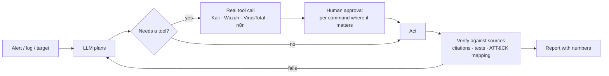
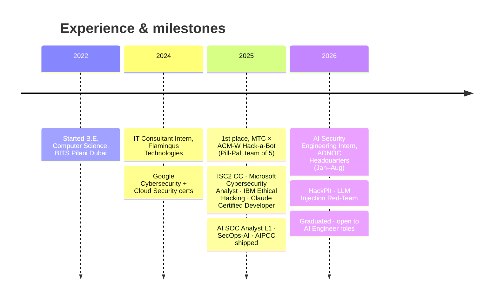
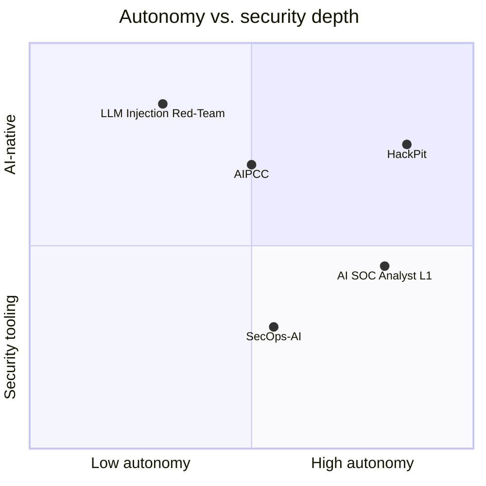

    

<b>AI Engineer · Agentic Systems · AI Security</b>

I build agentic AI systems and automation — LLM agents that plan and use real tools, RAG pipelines you can trace back to their sources, and the security thinking to keep both accountable.

## 🧭 How I build an agent

```mermaid
flowchart LR
    A[Alert / log / target] --> B[LLM plans]
    B --> C{Needs a tool?}
    C -- yes --> D[Real tool call<br/>Kali · Wazuh · VirusTotal · n8n]
    D --> E[Human approval<br/>per command where it matters]
    E --> F[Act]
    C -- no --> F
    F --> G[Verify against sources<br/>citations · tests · ATT&CK mapping]
    G --> H[Report with numbers]
    G -- fails --> B
```

## 🗓️ Timeline

```mermaid
timeline
    title Experience & milestones
    2022 : Started B.E. Computer Science, BITS Pilani Dubai
    2024 : IT Consultant Intern, Flamingus Technologies
         : Google Cybersecurity + Cloud Security certs
    2025 : 1st place, MTC × ACM-W Hack-a-Bot (Pill-Pal, team of 5)
         : ISC2 CC · Microsoft Cybersecurity Analyst · IBM Ethical Hacking · Claude Certified Developer
         : AI SOC Analyst L1 · SecOps-AI · AIPCC shipped
    2026 : AI Security Engineering Intern, ADNOC Headquarters (Jan–Aug)
         : HackPit · LLM Injection Red-Team
         : Graduated · open to AI Engineer roles
```

## 🧩 Where each project sits

```mermaid
quadrantChart
    title Autonomy vs. security depth
    x-axis Low autonomy --> High autonomy
    y-axis Security tooling --> AI-native
    HackPit: [0.85, 0.75]
    AI SOC Analyst L1: [0.8, 0.45]
    AIPCC: [0.5, 0.7]
    SecOps-AI: [0.55, 0.3]
    LLM Injection Red-Team: [0.3, 0.85]
```

## 🚀 Projects

- 🔐 **[HackPit](https://github.com/Zaidzyy/HackPit)** — An autonomous penetration-testing cockpit — an LLM agent plans an engagement over a 2,700+ technique knowledge base and drives real Kali tooling behind per-command human approval.  
  **2,700+** techniques · **30+** attack surfaces · **47k+** exploit CVE index · [GitHub](https://github.com/Zaidzyy/HackPit) · [Live](https://zaidzyy.github.io/HackPit)
- 🤖 **[AI SOC Analyst L1](https://github.com/Zaidzyy/AI-SOC-Analyst-L1)** — A 90-node autonomous SOC pipeline triaging Wazuh alerts end to end — dual threat-intel enrichment, local-LLM incident reports, and a measured 24% false-positive rate across 72 incidents.  
  **90** n8n nodes · **&lt;2 min** alert → report · **24%** false-positive rate · 72 incidents · [GitHub](https://github.com/Zaidzyy/AI-SOC-Analyst-L1) · [Live](https://zaidzyy.github.io/AI-SOC-Analyst-L1)
- 🧠 **[AIPCC](https://github.com/Zaidzyy/AIPCC)** — An AI cybersecurity co-pilot: ingest a security log, get an ATT&CK-mapped incident report with every finding cited to the log rows behind it — 0% hallucination, 100% grounding, gated in CI.  
  **0.0%** hallucination · **100%** grounding · **682** tests in CI · [GitHub](https://github.com/Zaidzyy/AIPCC) · [Live](https://zaidzyy.github.io/AIPCC)
- 🛡️ **[SecOps-AI](https://github.com/Zaidzyy/SecOps-AI)** — Real-time network-flow threat detection — a gradient-boosted classifier at 0.985 F1, MITRE ATT&CK attribution, and a Groq-accelerated LLM triage layer, all in one self-contained SOC console.  
  **0.985** F1 · **0.15%** per-flow false positives · **265** tests in CI · [GitHub](https://github.com/Zaidzyy/SecOps-AI) · [Live](https://zaidzyy.github.io/SecOps-AI)
- ⚡ **[LLM Injection Red-Team](https://github.com/Zaidzyy/ai-llm-injection)** — A reproducible harness for measuring LLM instruction-hierarchy robustness, a zero-dependency prompt-injection detector, and a documented direct-injection finding — framed around OWASP LLM01.  
  **10** technique classes · **52** offline tests · **LLM01** OWASP · MITRE ATLAS · [GitHub](https://github.com/Zaidzyy/ai-llm-injection)
- 💊 **[Pill-Pal](https://www.instagram.com/p/DG7k4LWzL-r/?img_index=1)** — AI medication-tracking chatbot on Telegram, built with Botpress. 🏆 1st place, MTC × ACM-W Hack-a-Bot Hackathon — Team Botless (team of 5).

## 🧰 Stack

- **AI & Agentic:** Claude · Codex · Ollama · LangChain · MCP · RAG · scikit-learn · Groq
- **Engineering:** Python · TypeScript · FastAPI · Next.js · React · PostgreSQL · Docker · n8n · GitHub
- **Offensive:** Kali Linux · Burp Suite · Metasploit · Nmap
- **SecOps:** Wazuh · Splunk · Microsoft Sentinel · VirusTotal · AbuseIPDB · MITRE ATT&CK

## 🎓 Education

**B.E. Computer Science** — BITS Pilani, Dubai Campus · 2022 – 2026

<picture>
  <source media="(prefers-color-scheme: dark)" srcset="https://raw.githubusercontent.com/Zaidzyy/notZaid/pacman-output/pacman-contribution-graph-dark.svg">
  <source media="(prefers-color-scheme: light)" srcset="https://raw.githubusercontent.com/Zaidzyy/notZaid/pacman-output/pacman-contribution-graph.svg">
  
</picture>
