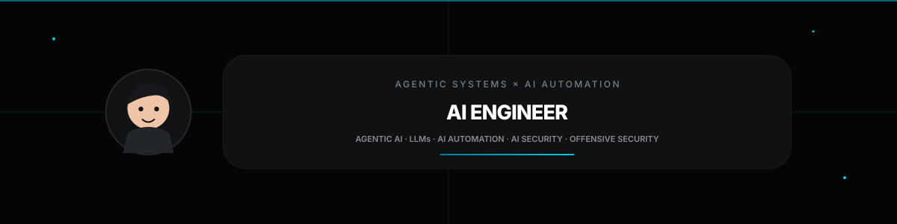

    

# Build. Automate. Secure.

AI Engineer · Agentic Systems · AI Security

<table>
<tr>
<td align="center" valign="top" width="33%">

### 🤖 Build

LLM agents that plan, call real tools, and finish the job — with a human approving the commands that matter.

 

**[HackPit](https://github.com/Zaidzyy/HackPit)** 2,700+ techniques

</td>
<td align="center" valign="top" width="33%">

### ⚙️ Automate

Pipelines that run without me: ingest, enrich, reason, report — and a number at the end to prove it.

 

**[AI SOC Analyst L1](https://github.com/Zaidzyy/AI-SOC-Analyst-L1)** 90 n8n nodes **[SecOps-AI](https://github.com/Zaidzyy/SecOps-AI)** 0.985 F1

</td>
<td align="center" valign="top" width="33%">

### 🛡️ Secure

Grounding you can audit, injection you can measure, and security thinking around every action.

 

**[AIPCC](https://github.com/Zaidzyy/AIPCC)** 0.0% hallucination **[LLM Injection Red-Team](https://github.com/Zaidzyy/ai-llm-injection)** 10 technique classes

</td>
</tr>
</table>

## Who

I build agentic AI systems and automation — LLM agents that plan and use real tools, RAG pipelines you can trace back to their sources, and the security thinking to keep both accountable.

**ADNOC Headquarters** · AI Security Engineering Intern · Jan – Aug 2026  
**Flamingus Technologies** · IT Consultant Intern · Jun – Aug 2024  
**B.E. Computer Science** — BITS Pilani, Dubai Campus · 2022 – 2026

## Proof

| | |
|---|---|
| 🏆 **1st place**, MTC × ACM-W Hack-a-Bot — [Pill-Pal](https://www.instagram.com/p/DG7k4LWzL-r/?img_index=1) (Team Botless, team of 5) | 📝 [Writeup](https://medium.com/@thezaiduniverse/ai-soc-agent-autonomous-security-operations-engine-c8c7b87d6ce3?sk=848e706b391de6b3242380dc12c50e40): 90 n8n nodes, local LLM, 24% FP across 72 incidents |
| 🎓 6 verified certs — Anthropic · ISC2 · Microsoft · Google ×2 · IBM | 🔁 1,000+ tests in CI across the repos |

## Stack

**AI & Agentic** — Claude · Codex · Ollama · LangChain · MCP · RAG · scikit-learn · Groq  
**Engineering** — Python · TypeScript · FastAPI · Next.js · React · PostgreSQL · Docker · n8n · GitHub  
**Offensive** — Kali Linux · Burp Suite · Metasploit · Nmap  
**SecOps** — Wazuh · Splunk · Microsoft Sentinel · VirusTotal · AbuseIPDB · MITRE ATT&CK  

<picture>
  <source media="(prefers-color-scheme: dark)" srcset="https://raw.githubusercontent.com/Zaidzyy/notZaid/pacman-output/pacman-contribution-graph-dark.svg">
  <source media="(prefers-color-scheme: light)" srcset="https://raw.githubusercontent.com/Zaidzyy/notZaid/pacman-output/pacman-contribution-graph.svg">
  
</picture>

  

  

