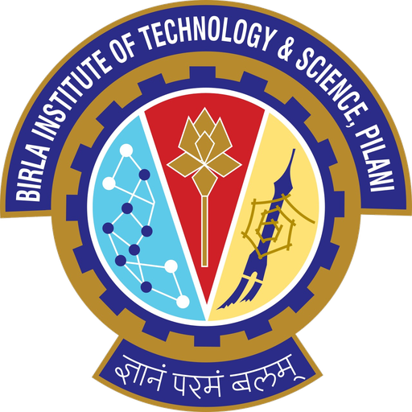

   

### AI Engineer · Agentic Systems · AI Security

  
  &nbsp;
  <strong>B.E. Computer Science</strong>
  &nbsp;·&nbsp;
  BITS Pilani
  &nbsp;·&nbsp;
  <code>Sep 2022 — Sep 2026</code>

  
  &nbsp;
  <strong>AI Security Engineering Intern</strong>
  &nbsp;·&nbsp;
  ADNOC Headquarters
  &nbsp;·&nbsp;
  <code>Jan 2026 — Aug 2026</code>

## 🧰 Stack

  

  
  
  
  
  
  
  
  
  
  

Every number below is measured in the linked repo — nothing here is a guess.

## 📈 By the numbers

| Project | | | | Links |
|---|:-:|:-:|:-:|---|
| 🔐 **[HackPit](https://github.com/Zaidzyy/HackPit)** | **2,700+** techniques | **30+** attack surfaces | **47k+** exploit CVE index | [GitHub](https://github.com/Zaidzyy/HackPit) · [Live](https://zaidzyy.github.io/HackPit) |
| 🤖 **[AI SOC Analyst L1](https://github.com/Zaidzyy/AI-SOC-Analyst-L1)** | **90** n8n nodes | **&lt;2 min** alert → report | **72** incidents analyzed | [GitHub](https://github.com/Zaidzyy/AI-SOC-Analyst-L1) · [Live](https://zaidzyy.github.io/AI-SOC-Analyst-L1) |
| 🧠 **[AIPCC](https://github.com/Zaidzyy/AIPCC)** | **0.0%** hallucination | **100%** grounding | **682** tests in CI | [GitHub](https://github.com/Zaidzyy/AIPCC) · [Live](https://zaidzyy.github.io/AIPCC) |
| 🛡️ **[SecOps-AI](https://github.com/Zaidzyy/SecOps-AI)** | **0.985** F1 | **0.15%** per-flow false positives | **265** tests in CI | [GitHub](https://github.com/Zaidzyy/SecOps-AI) · [Live](https://zaidzyy.github.io/SecOps-AI) |
| ⚡ **[LLM Injection Red-Team](https://github.com/Zaidzyy/ai-llm-injection)** | **10** technique classes | **52** offline tests | **LLM01** OWASP · MITRE ATLAS | [GitHub](https://github.com/Zaidzyy/ai-llm-injection) |

| | | |
|:-:|:-:|:-:|
| **5+** projects shipped | **6** industry certs — Anthropic, ISC2, Microsoft, Google, IBM | **1,000+** tests in CI across the repos (conservative sum) |

## Proof

| | |
|---|---|
| 🏆 **1st place**, MTC × ACM-W Hack-a-Bot — [Pill-Pal](https://www.instagram.com/p/DG7k4LWzL-r/?img_index=1) (Team Botless, team of 5) | 📝 [Writeup](https://medium.com/@thezaiduniverse/ai-soc-agent-autonomous-security-operations-engine-c8c7b87d6ce3?sk=848e706b391de6b3242380dc12c50e40): 90 n8n nodes, local LLM, 24% FP across 72 incidents |
| 🎓 6 verified certs — Anthropic · ISC2 · Microsoft · Google ×2 · IBM | 🔁 1,000+ tests in CI across the repos |

## 🎧 Listening

  

  

## 📊 GitHub

  
  

  

<picture>
  <source media="(prefers-color-scheme: dark)" srcset="https://raw.githubusercontent.com/Zaidzyy/notZaid/pacman-output/pacman-contribution-graph-dark.svg">
  <source media="(prefers-color-scheme: light)" srcset="https://raw.githubusercontent.com/Zaidzyy/notZaid/pacman-output/pacman-contribution-graph.svg">
  
</picture>

**Anyone can wire an AI to a tool.** [**Wire it to a leash.**](https://notzaid.vercel.app/)

